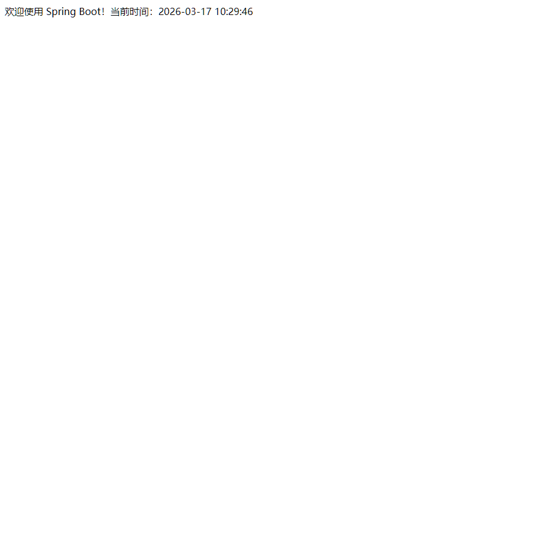
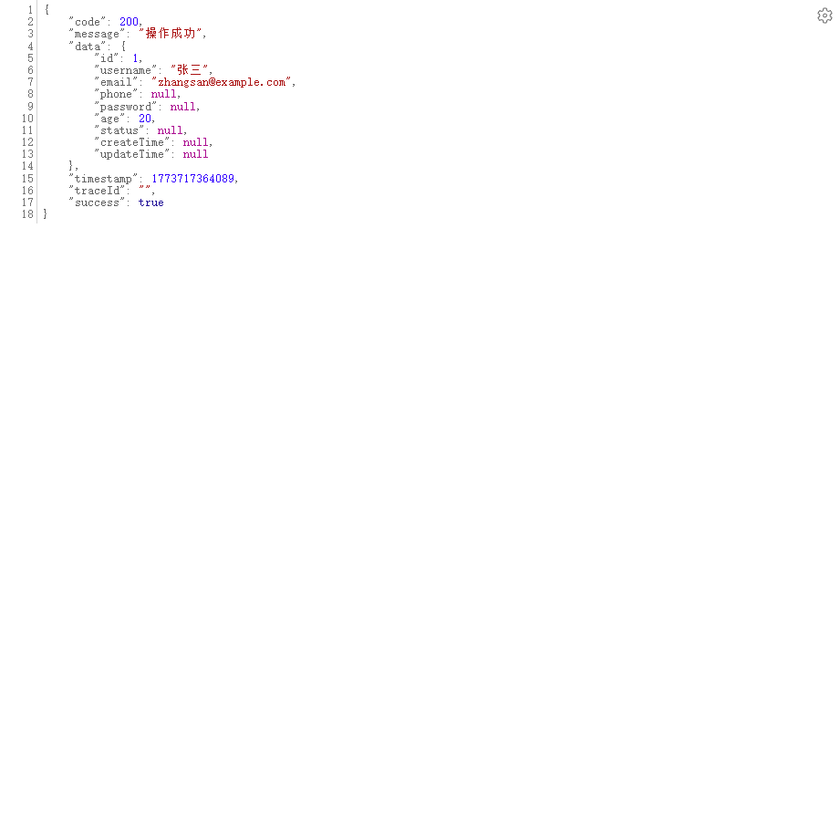
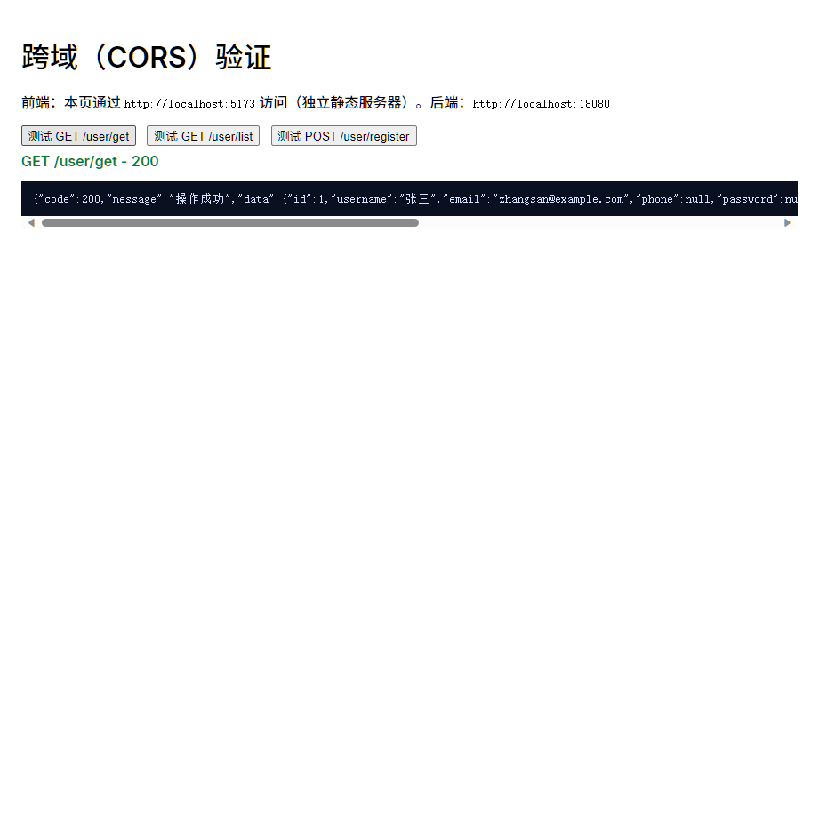
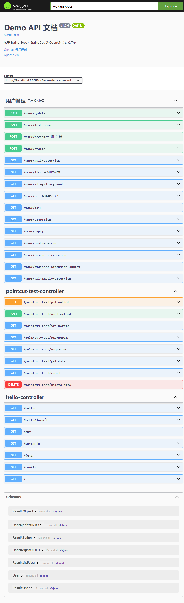

# 实验报告（第 1 次）

| 项目 | 内容 |
|---|---|
| 实验名称 | Spring Boot 基础能力综合实验（Week1-4） |
| 实验时间 | 【待填写】 |
| 同组同学 | 【待填写】 |
| 小组分工 | 【待填写】 |

## 一、实验目的

1) 掌握 Spring Boot 工程的多环境配置与 Profile 切换方法，理解 `application.yaml` 与 `application-{profile}.yaml` 的加载优先级，以及 `@Profile` 条件化 Bean 的生效机制。
2) 掌握 DevTools 的开发期能力，能够通过热重启日志验证配置变更触发的重载行为，并了解常见排障思路。
3) 掌握统一响应结构与全局异常处理：通过 `Result<T>`/`ResultCode` 标准化接口返回，并用 `@RestControllerAdvice` 集中处理业务异常与系统异常。
4) 掌握 Jakarta Validation 参数校验的常用注解、自定义约束、分组校验与快速失败配置，并能通过接口调用与单测验证其效果。
5) 理解 AOP 的横切关注点思想，能通过自定义注解与切面实现操作日志记录，并验证正常/异常两条链路。
6) 理解浏览器同源策略与 CORS 预检机制，能通过真实跨域页面与预检请求验证跨域配置是否生效。
7) 掌握 SpringDoc + Swagger UI 自动生成 API 文档的流程，能够配置 OpenAPI 基本信息并为接口/DTO 增加注解增强可读性。

## 二、实验仪器设备或材料

- 硬件：可运行开发环境的个人电脑（Windows）
- 软件与环境：
  - JDK 21+（本机执行使用 `C:/Program Files/Java/jdk-22`）
  - Maven Wrapper（`demo/` 下 `./mvnw`）
  - Spring Boot 3.5.11（以 `demo/pom.xml` 为准）
  - IDE（IntelliJ IDEA/VS Code 均可）
  - 浏览器（用于 Swagger UI/跨域页面/截图取证）
  - curl（用于接口取证；本机可能需 `--noproxy "*"` 避免代理影响）
  - Python（用于 Week3 5173 静态服务器 `python -m http.server 5173`）

## 三、实验原理

### 1) 多环境配置与 Profile（Week1）

Spring Boot 支持基于 Profile 的分环境配置。通常通过 `spring.profiles.active` 激活某个环境，并使用 `application-{profile}.yaml` 提供该环境特定的配置项。结合 `@Profile` 注解可以实现“仅在某些环境下装配特定 Bean”，从而在不修改代码逻辑的情况下切换实现。

### 2) DevTools 热重启（Week1）

DevTools 主要用于开发期提升效率。当检测到 classpath 资源变化（如配置文件、类文件）时，可以触发应用上下文重启。通过控制台日志（如 `Restarting due to ...`）可以确认热重启是否发生。

### 3) 统一响应与异常处理（Week2）

统一响应通过一个标准结构（例如 `code/message/data/success/timestamp/traceId`）让前端/调用方稳定解析接口返回。异常处理通过全局异常处理器将不同异常类型映射为统一的 `Result`，减少 Controller 代码里的重复 try/catch，并确保错误信息与 HTTP 状态可控。

### 4) 参数校验（Week2）

Jakarta Validation 通过注解声明校验规则（如 `@NotBlank/@Email/@Min/@Max`），在请求进入业务逻辑前拦截非法输入。自定义约束可通过 `ConstraintValidator` 扩展规则；分组校验可在同一 DTO 上表达“创建/更新”的不同必填项；快速失败可以在出现第一个错误后立即停止校验。

### 5) AOP 日志切面（Week3）

AOP 将日志记录这类横切关注点从业务逻辑中抽离出来。通过自定义注解（如 `@Log`）标注目标方法，在切面中环绕执行并记录请求信息、参数、耗时、成功/异常等，实现统一、可复用的日志能力。

### 6) CORS 跨域与预检（Week3）

浏览器同源策略限制跨域访问。服务端通过配置 CORS 响应头允许指定来源、方法与请求头。当请求为“非简单请求”时浏览器会先发送 OPTIONS 预检请求，只有预检通过才会发起实际请求。通过抓取预检响应与跨域页面调用结果可以验证配置正确性。

### 7) SpringDoc/OpenAPI（Week4）

SpringDoc 会在运行期扫描 Spring MVC 的 Controller/DTO/注解，生成 OpenAPI 规范的 JSON（`/v3/api-docs`），并提供 Swagger UI 页面（`/swagger-ui.html`）用于在线浏览与调试接口。通过 `OpenApiConfig` 可以定义文档的标题、描述、版本等元信息，通过 `@Tag/@Operation/@Parameter/@Schema` 等注解增强文档可读性。

## 四、实验内容与步骤

> 说明：课程文档常用端口为 8080；但本机 Windows 环境存在 TCP 排除端口范围 **8000-8099**（包含 8080），因此涉及“实际启动取证”的步骤统一用 `18080`（运行参数覆盖端口，不改动/不提交 YAML）。

### Week1：DevTools 与多环境配置

1) 在 `demo/src/main/resources/` 下补齐多环境配置文件：`application.yaml`、`application-dev.yaml`、`application-test.yaml`、`application-prod.yaml`。
2) 编写 `HelloController` 与 `@ConfigurationProperties` 配置类，实现 `/hello`、`/config`、`/env`、`/data` 等接口，用于验证配置读取与 Profile 条件化 Bean。
3) 运行测试：
   - `cd demo && ./mvnw test`
4) 启动应用并取证（dev/test/prod 通过不同端口与 profile 参数）：
   - `./mvnw spring-boot:run -Dspring-boot.run.arguments="--server.port=18080 --spring.profiles.active=dev"`
   - `./mvnw spring-boot:run -Dspring-boot.run.arguments="--server.port=18081 --spring.profiles.active=test"`
   - `./mvnw spring-boot:run -Dspring-boot.run.arguments="--server.port=18082 --spring.profiles.active=prod"`

### Week2：统一响应、异常处理与参数校验

1) 引入 validation 依赖，并实现 `ResultCode`、`Result<T>` 统一返回结构。
2) 增加业务异常与全局异常处理器，补齐 UserController 的测试接口与异常触发接口。
3) 实现 DTO 校验、自定义校验（密码强度/枚举）与分组校验，并在接口中使用 `@Valid/@Validated`。
4) 运行测试：`cd demo && ./mvnw test`。
5) 启动应用并使用 curl 取证，保存响应到 `docs/labs/weekly/assets/week2/`。

### Week3：日志切面与跨域配置

1) 引入 AOP 依赖，创建 `@Log` 注解与日志切面，在 `UserController` 关键方法上标注并验证正常/异常日志。
2) 完成 Pointcut 练习 Controller/Aspect，通过访问接口触发“✅ 练习X”日志。
3) 添加全局 CORS 配置与静态测试页 `test.html`，使用 Python 启动 5173 静态服务器并通过浏览器验证跨域成功；同时保存预检响应。
4) 运行测试：`cd demo && ./mvnw test`。

### Week4：API 文档生成（SpringDoc + Swagger UI）

1) 引入 SpringDoc 依赖，并在 `application.yaml` 中配置 `springdoc.api-docs.path` 与 `springdoc.swagger-ui.path`。
2) 创建 `OpenApiConfig` 配置 OpenAPI 基本信息。
3) 为 `UserController` 与相关 DTO/枚举增加 Swagger/OpenAPI 注解，增强文档分组与接口描述。
4) 运行测试：`cd demo && ./mvnw test`。
5) 启动应用并验证：
   - Swagger UI：`http://localhost:18080/swagger-ui.html`
   - OpenAPI JSON：`http://localhost:18080/v3/api-docs`

## 五、实验结果与分析

### 1) Week1 结果

- 主页与基础接口可访问（证据）：

- 说明：Week1 通过不同 profile 启动后，`/data` 返回不同数据；`/config` 中能看到 activeProfile/serverPort 等信息；DevTools 热重启可通过日志片段确认。

### 2) Week2 结果

- 统一响应结构与示例接口返回（证据）：

- 分析：统一响应保证了成功/失败/异常场景下字段稳定；参数校验将非法输入在进入业务前拦截，返回 HTTP 400 并给出可读的 message；分组校验使“创建/更新”要求更清晰。

### 3) Week3 结果

- 跨域页面验证成功（证据）：

- 分析：通过真实浏览器环境验证了 CORS 配置与预检响应头生效；AOP 切面在不侵入业务代码的前提下统一记录操作日志，并对敏感字段进行脱敏。

### 4) Week4 结果

- Swagger UI 页面截图（证据，W4 取证生成）：

- 分析：SpringDoc 能自动生成 OpenAPI JSON 与 Swagger UI 页面；通过注解可将接口分组、描述清晰化并提升在线调试体验。若 `/swagger-ui.html` 发生跳转到 `/swagger-ui/index.html`，属于正常路由行为。

## 六、结论与体会

本次实验按 Week1~Week4 的顺序完成了 Spring Boot 的基础能力落地与验证，从配置/环境切换、统一响应与异常处理、参数校验、AOP 日志到 CORS 跨域与 OpenAPI 文档生成形成了一条完整的工程闭环。通过将“文档中的验证步骤”固化为周总结中的 checklist，并把截图/响应输出作为证据提交，使得实验过程可复现、可审计。实践中发现 Windows 存在端口排除范围会导致文档示例端口不可用，因此需要通过运行参数覆盖端口并在报告中说明适配原因；此外 curl 可能受到代理变量影响，需要通过 `--noproxy "*"` 规避。参数校验与全局异常处理的组合显著提升了接口稳定性，AOP 切面则让日志记录更一致且便于后续扩展。后续可在保持当前结构的基础上继续完善 Swagger 注解覆盖率，并补充更细致的错误码与 traceId 贯通能力。

## 七、教师评语

【待填写】
